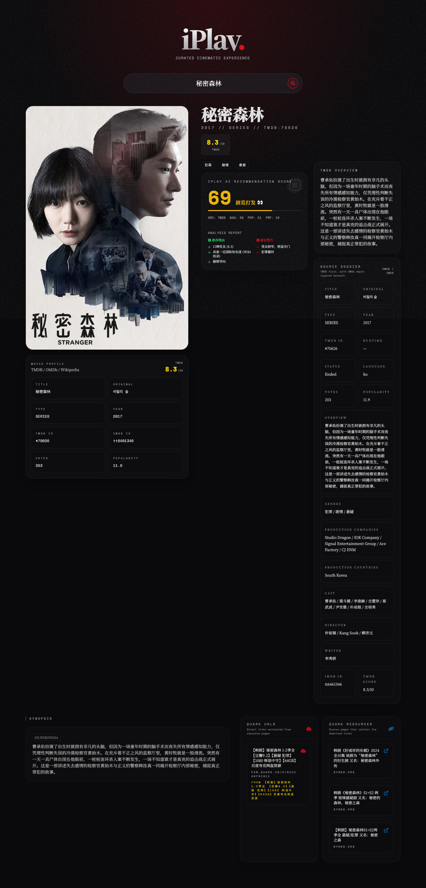

<!-- GSD-DOCS: README | mode=supplement | generated=2026-04-24 -->

# 🎬 iPlay - 沉浸式观影指南与推荐系统

> 一个懂你的追剧神器：偏好分析 · TMDB 主数据 · 夸克资源直达

iPlay 是一款拥有独特"暗黑电影院"复古美学的前端应用，结合个人观影偏好算法与互联网公开数据（TMDB、豆瓣、Wikipedia 剧情、夸克网盘资源），为你生成个性化的剧集推荐指数。



## ✨ 核心亮点

- 🍿 **沉浸式美学 UI**：电影胶片噪点、泛光环境特效、打字机光标，极致的暗黑复古感
- 🧠 **私人定制推荐算法**：不仅看豆瓣客观评分，更结合你的主观类型偏好（喜爱喜剧/melo，拒接血腥/悲剧）以及全网热度，得出专属"iPlay 推荐指数"
- ⚡️ **全无感破墙架构**：使用 Cloudflare Worker 完美绕过浏览器 CORS 跨域限制，实时抓取 TMDB、豆瓣和资源站数据
- 📦 **真正的 Serverless**：前端纯静态托管于 GitHub Pages，零服务器运维成本

## 🏗 技术栈与架构设计

本项目采用极致轻量级的"前后端分离 Serverless"架构：

### Frontend (前端)
- **核心框架**：HTML5 + Vanilla JavaScript (ES Modules)
- **视觉样式**：Tailwind CSS CLI
- **部署平台**：[GitHub Pages](https://pages.github.com/)
- **特点**：前端结构轻量，样式通过本地 Tailwind CLI 生成

### Backend (后端代理抓取层)
- **运行环境**：[Cloudflare Workers](https://workers.cloudflare.com/)
- **核心逻辑**：TMDB 优先，豆瓣 / OMDb / Wikipedia 作为补充来源，Worker 统一做数据聚合和跨域代理
- **特性**：全球 CDN 边缘节点计算，处理跨域(CORS)和数据聚合

## 📁 项目结构

```
iplay/
├── index.html              # 主入口页面（暗黑影院主题 UI）
├── css/
│   ├── input.css           # Tailwind 主题配置（自定义颜色/字体）
│   └── output.css          # Tailwind CLI 构建产物（已 minify）
├── js/
│   ├── main.js             # 前端主逻辑：搜索、渲染、详情展示
│   ├── api.js              # API 客户端封装（TMDB/Douban/Wiki/Resource/Poster）
│   ├── quark.js            # 夸克链接与提取码复制文本格式化
│   └── scorer.js           # 个性化推荐打分算法与标签体系
├── worker/
│   └── _worker.js          # Cloudflare Worker 代理服务（CORS  bypass + 数据聚合）
├── tests/                  # Node.js 内置测试运行器测试
├── package.json            # npm 脚本与开发依赖
├── wrangler.toml           # Cloudflare Worker 部署配置
└── README.md               # 本文件
```

## 🚀 部署属于你自己的 iPlay

### 1. 部署后端 (Cloudflare Worker)
1. 登录 Cloudflare Dashboard，进入 **Workers & Pages** -> 创建 Worker。
2. 将本项目中 `worker/_worker.js` 文件的内容复制粘贴到 Worker 的代码编辑器中并保存部署。
3. 在 Worker 的 **Settings** -> **Variables** 中配置：
   - `TMDB_ACCESS_TOKEN`：TMDB v4 Read Access Token（推荐）
   - 或 `TMDB_API_KEY`：TMDB v3 API Key（二选一）
   - `OMDB_API_KEY`：可选；配置后启用 IMDb / Rotten Tomatoes 等 OMDb 补充数据，项目不内置 Key
   - `CORS_ALLOWED_ORIGINS`：可选，额外允许的前端 Origin，多个值用英文逗号分隔
4. 如果使用 Dashboard 手工部署并希望启用定时预热，请在 **Triggers** 中添加 `0 */6 * * *` Cron Trigger；Wrangler 部署会读取仓库中的 `wrangler.toml` 自动配置它。
5. 记录下部署成功后的 Worker 域名（例如：`https://iplay-api.yourname.workers.dev`）。
6. 如果使用 Cloudflare CLI，也可以执行：
   ```bash
   npm run wrangler -- secret put TMDB_ACCESS_TOKEN
   npm run wrangler -- secret put OMDB_API_KEY
   ```
   然后按提示粘贴对应的密钥值。

### 2. 部署前端 (GitHub Pages)
1. Fork 本仓库。
2. 修改 `js/api.js` 中的 `API_BASE`，将生产地址指向你刚刚部署的 Worker 域名：
   ```javascript
   const API_BASE = location.hostname === 'localhost' || location.hostname === '127.0.0.1'
       ? 'http://localhost:8787'
       : 'https://iplay-api.yourname.workers.dev';
   ```
3. 提交修改并推送到 GitHub。
4. 将你的 GitHub Pages Origin（例如 `https://yourname.github.io`）加入 Worker 的 `CORS_ALLOWED_ORIGINS`。
5. 在 GitHub 仓库的 **Settings** -> **Pages** 中，选择 `main` 分支作为 Source 进行部署即可。

### 3. 本地预览与验证
1. 使用 Node.js >= 20.19.0（推荐 22 LTS），安装依赖并生成样式：
   ```bash
   npm install
   npm run build
   ```
2. 在一个终端中准备本地密钥并启动 Worker：
   ```bash
   cp .dev.vars.example .dev.vars
   npm run wrangler -- dev
   ```
   本地页面会按 `js/api.js` 的配置请求 `http://localhost:8787`；至少需要在 `.dev.vars` 中配置 `TMDB_ACCESS_TOKEN` 或 `TMDB_API_KEY`。
3. 在另一个终端中启动静态服务器：
   ```bash
   python3 -m http.server 8080
   ```
4. 打开 `http://localhost:8080`，搜索一个中文片名、一个中文剧集名和一个英文片名。
5. 确认 TMDB 结果优先展示，IMDb / Rotten Tomatoes 作为外部评分补充，Douban 仅在需要时补缺。

## 🛠 自定义你的打分算法
如果你想修改类型偏好的权重，请打开 `js/scorer.js`，修改 `PREFERENCE_WEIGHTS` 常量：

```javascript
const PREFERENCE_WEIGHTS = {
    // 根据你的喜好随意调整
    '喜剧': { score: 1.5, reason: '符合喜剧偏好' },
    '爱情': { score: 1.2, reason: '包含浪漫元素' },
    '恐怖': { score: -2.0, reason: '不喜欢恐怖题材' },
    // ...
};
```

## 🧪 可用脚本

| 命令 | 说明 |
|------|------|
| `npm run build` | 使用 Tailwind CSS CLI 构建生产样式 (`css/output.css`) |
| `npm run lint` | 使用 ESLint 检查项目 JavaScript 代码规范 |
| `npm run test:coverage` | 使用 Node.js 内置测试运行器生成覆盖率报告 |
| `npm test` | 依次运行 Node.js 测试、lint 和生产构建 |
| `npm run wrangler -- <command>` | 使用仓库固定的 Wrangler 4.106.0 运行本地 Worker 或部署命令 |

## 📜 协议

[ISC License](./LICENSE)
